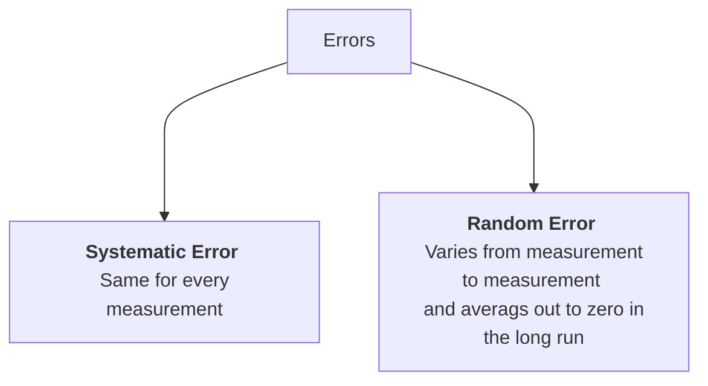
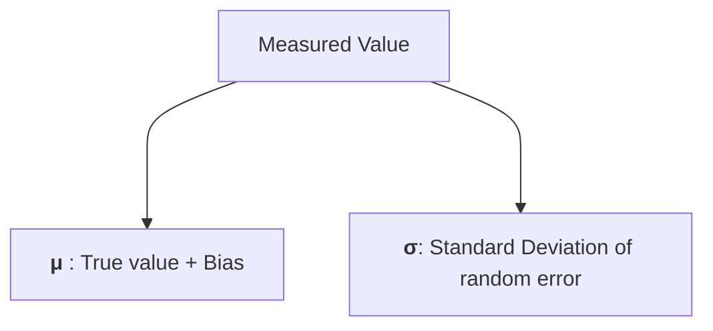

# Experimental-Methods-Codes
Lab Projects carried out for completion of the course MCL705 - Experimental Methods

Set of projects that needs to be carried out as part of completion of the course:
1) Uncertainty Analysis of Heat Exchanger
2) Estimating the viscosity of SAE fluids using Image Processing in MATLAB
3) Estimating the convective heat transfer coefficient for cooling of an Al cylinder
4) Creating a setup for measuring coefficient of friction between two surfaces and measuring the uncertainty for the same.

Some theory of Uncertainty Analysis and Propagation which is common:

### Propagation of Error
- When a calculation is performed with measurements, the errors in the measurements produce an error in the calculated value.
- Difference between a measured value and true value is called the **error** in the measured value.
- Errors can be classified as follows:

- Measured value = true value + bias + random error
- Model each measured value as a random variable sampled from the space of all possible measurements. The parameters of this random variable can be shown as below

- **Accuracy** - Difference between $\mu$ and true value. Smaller the bias, the more accurate the measuring process. If $\mu=$ true values, the the measuring process is called **unbiased**.
- **Precision** - Repeated measurement if lie in very narrow band $\implies$ high precision, but if it lies in a wider range $\implies$ low precision. As it depends on the spread of the measurement, hence it is determined by $\sigma$.
- Hence, $\sigma$ is referred to as random uncertainty, statistical uncertainty or simply uncertainty.
- Process of estimation of bias is called *calibration*.
- Now, estimating bias in a measurement is very difficult as compared to estimating the uncertainty in measurement, simply because we generally don't know what is the true value that is being measured.
